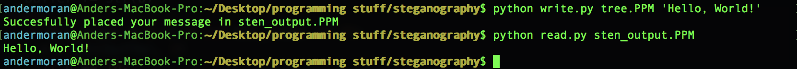

# Python Steganography Example

An example of steganography implemented with Python2. Inspired by [this video](https://www.youtube.com/watch?v=TWEXCYQKyDc). Steganography is about hiding information in plain sight.

## Usage
Usage: `python write.py your_input_image.PPM 'your secret message'`

Usage: `python read.py your_output_image.PPM`

## Example

`python write.py tree.PPM 'Hello, World!'`

`python read.py sten_output.PPM`